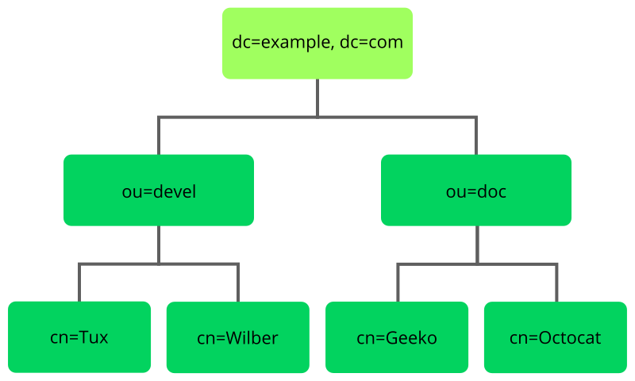
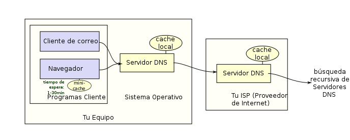

:doctype: book
:figure-caption: Figura
:table-caption: Taula
:example-caption: Exemple
:author: Xavi Quiñones
:email: mail@xavi.tech
:revdate: Abr 30, 2023
:revnumber: 1.0
:encoding: utf-8
:lang: es
:toc: left
:toclevels: 3
:icons: font

= LDAP y DNS

== LDAP

LDAP es un conjunto de reglas y estándares que definen como se comunican los dispositivos de una red para acceder, gestionar y almacenar información almacenada en direcotiros o servicios de manera eficiente y segura.

=== Jerarquía y estructura

Se organiza en una jerarquía de registros que contienen información sobre los usuarios o entidades.

Cuando se habla de jerarquía, no se está haciendo referencia a los permisos de estas entidades sobre el directorio LDAP, sino, sobre los criterios estructurales de la organización.

Supongamos que tenemos una empresa con varios departamentos y empleados. La estructura jerárquica en el directorio LDAP podría ser la siguiente:

* Base DN: dc=ejemplo, dc=com (la raíz del directorio)

Dentro de la base DN, podemos tener unidades organizativas (OU) para diferentes departamentos:

* OU=Ventas, dc=ejemplo, dc=com (Unidad Organizativa para el Departamento de Ventas)
* OU=Marketing, dc=ejemplo, dc=com (Unidad Organizativa para el Departamento de Marketing)
* OU=Recursos Humanos, dc=ejemplo, dc=com (Unidad Organizativa para el Departamento de Recursos Humanos)

Dentro de cada unidad organizativa, podemos tener más subunidades organizativas o las entradas individuales de los empleados:

* OU=Ventas, dc=ejemplo, dc=com

- OU=Equipo1, ou=Ventas, dc=ejemplo, dc=com (Subunidad Organizativa para el Equipo 1 de Ventas)

** cn=Juan Perez, ou=Equipo1, ou=Ventas, dc=ejemplo, dc=com (Entrada para el empleado Juan Perez)

** cn=Ana Sánchez, ou=Equipo1, ou=Ventas, dc=ejemplo, dc=com (Entrada para la empleada Ana Sánchez)

- OU=Equipo2, ou=Ventas, dc=ejemplo, dc=com (Subunidad Organizativa para el Equipo 2 de Ventas)

** cn=Beatriz Gómez, ou=Equipo2, ou=Ventas, dc=ejemplo, dc=com (Entrada para la empleada Beatriz Gómez)

* OU=Marketing, dc=ejemplo, dc=com

** OU=Investigación, ou=Marketing, dc=ejemplo, dc=com (Subunidad Organizativa para el Equipo de Investigación de Marketing)

*** cn=Paula Torres, ou=Investigación, ou=Marketing, dc=ejemplo, dc=com (Entrada para la empleada Paula Torres)

* OU=Recursos Humanos, dc=ejemplo, dc=com

** cn=Carlos González, ou=Recursos Humanos, dc=ejemplo, dc=com (Entrada para el empleado Carlos González)

En este ejemplo, se muestra una posible estructura estándar de una jerarquía en LDAP, donde los equipos pertenecen a distintas unidades organizativas (OU) según su departamento y cada participante tiene su propio Distinguished Name (DN).

=== Distinguished Name

El DN es la manera única de identificar uno de los registros en un directorio LDAP.

Por ejemplo, a partir del empleado _Carlos González_ podemos ver la estructura de un DN:

* "cn=Carlos González" indica el nombre común (common name) de la entrada, que es el nombre del empleado Carlos González.
* "ou=Recursos Humanos" es la unidad organizativa (organizational unit) a la que pertenece la entrada del empleado. En este caso, el empleado Carlos González se encuentra en la unidad organizativa de Recursos Humanos.
* "dc=ejemplo, dc=com" representa los componentes de dominio (domain components) de la organización. En este caso, el dominio se denomina "ejemplo.com".

=== Casos de uso

* Autenticación centralizada: LDAP se utiliza ampliamente para autenticar usuarios en una red, permitiendo que los usuarios inicien sesión con un único conjunto de credenciales en diferentes servicios y sistemas.
* Directorio de empleados: LDAP es útil para almacenar información de empleados, como nombres, números de teléfono, direcciones de correo electrónico y detalles de la organización, lo que facilita la búsqueda y recuperación de información.
* Gestión de grupos y permisos: LDAP se utiliza para organizar y gestionar grupos de usuarios, así como para asignar permisos y derechos de acceso a diferentes recursos en la red.
* Integración de aplicaciones: LDAP se utiliza para la integración de aplicaciones y sistemas, permitiendo compartir información de usuarios y autenticación entre diferentes sistemas de la organización.

== DNS (Domain Name System)

Es un servicio descentralizado para dispositivos conectados a una red IP (Internet o privada) que traduce nombres de dominio (FQND) en direcciones IP.

=== FQDN

*Fully Qualified Domain Name* es el nombre completo, que incluye, tanto el nombre de host, como el dominio de nivel supoerior (TLD). Algunos ejemplos: xavi.iesbadia / www.debian.org / python.org

* Nombre del host: debian

* TLD: .org

=== Proceso de resolución

Cuando intentas acceder a un sitio web, es el sistema operativo quien inicia el proceso de resolución de DNS.

El SO primero busca en la caché local para ver si ya tiene la dirección IP del servidor asociado a el nombre de dominio. Si esta información no está disponible, se envía la consulta a los servidores DNS que tengamos configurados, muchas veces estos, los proporciona el proveedor de internet y si estos no son capaces de resolver la consulta, la envían a un nivel superior de la jerarquía hasta que la IP sea resuelta.

=== Tipos de registros

* *Registro A* Asocia un nombre de dominio con una dirección IP.

* *Registro AAAA* Asocia un nombre de dominio con una dirección IPv6.

* *Registro MX* Especifica el servidor de correo electrónico que está autorizado para recibir correo para un dominio específico.

* *Registro CNAME* Asocia un nombre de dominio con otro nombre de dominio. Por ejemplo, "www" puede ser un CNAME para el nombre de dominio raíz.

* *Registro TXT* Permite a los propietarios del dominio incluir información adicional, como registros SPF (Sender Policy Framework) que ayudan a prevenir el spam.

* *Registro NS* Especifica los servidores de nombres autorizados para un dominio en particular.

* *Registro SRV* Permite especificar servicios adicionales, como VoIP o mensajería instantánea, para un dominio en particular.

