:figure-caption: Figura
:table-caption: Taula
:example-caption: Exemple
:author: Xavier Quiñones DAW-2
:encoding: utf-8
:toc: left
:toclevels: 3
:icons: font

= M08-UF2 DOCKER COMPOSE

== Apuntes

=== Diferencias entre "Dockerfile" y "docker-compose.yml"

Los *Dockerfile* son la herramienta fundamental para construir imágenes de Docker. Estos archivos contienen una serie de instrucciones necesarias para construir una imagen personalizada, como la instalación de paquetes, la copia de archivos y la configuración de variables de entorno.

*Docker Compose* es una herramienta que permite ejecutar varios contenedores de Docker como si fueran una sola aplicación. Cada contenedor se define como un servicio con un nombre específico, y se pueden vincular entre sí para proporcionar una funcionalidad más compleja. Docker Compose facilita el despliegue y la gestión de aplicaciones que requieren varios contenedores, y se puede utilizar para definir y configurar toda la pila de aplicaciones en un solo archivo YAML.

=== Analisís de un YAML "docker-compose.yml"

* Indicamos la versión de la sintaxis del archivo "Dockerfile". En este caso la version 3.
----
version: '3'
----

* Indicamos que van a definirse una lista de servicios (web, php, db, phpmyadmin en el ejemplo)

----
services:
----

==== web

* Se le asigna un nombre al servicio. Este servicio será el servidor HTTP.
----
web:
----

* Se utiliza una imagen de _Apache HTTP_, en este caso es el contenedor httpd:2.4.
----
image: httpd:2.4
----

* Se configura un volumen, es decir *"un mecanismo para compartir dataos entre contenedores y el host"*. en este caso, se mapea la carpeta local "./web" al directorio "/usr/local/apache2/htdocs/", permitiendo que el contenido de la carpeta local se muestre en el servidor web.
----
volumes:
    - ./web:/usr/local/apache2/htdocs/
----

* Se mapea el puerto 80 del contenedor al puerto 80 del host local, para que el sitio web que se sirve, sea accesible desde el navegador.
----
ports:
    - "80:80"
----

* Definimos las dependencias entre servicios. En este caso, el servicio *web* depende de *php* y de *db*, por lo tanto, antes de que se ejecute el contenedor *web*, se garantizará que los contenedores de los que depende, estén en ejecución. *"depends_on"* es utilizado para establecer un orden de arranque.
----
depends_on:
    - php
    - db
----

==== php

* Se le asigna un nombre al servicio. Este servicio será el lenguage e interprete de PHP.
----
php:
----

* En este caso, en lugar de una imagen ya definida, se construirá una personalizada en base al Dockerfile ubicado en el directorio "./php".
----
build: ./php/
----

* Mapeamos "./web" del host a "/var/www/hmtl/" del contenedor, ya que este servicio es responsable de procesar los archivos PHP del site y enviar la respuesta procesada (HTML) al servicio *web*, que entonces, envia al cliente que realiza la petición HTTP. Entonces, los archivos PHP del directorio "./web" son accesibles tanto por los servicios *web* como por *php*
----
volumes:
      - ./web:/var/www/html/
----

* Se establece una dependencia de "db"
----
depends_on:
    - db
----

==== db

* Usamos una imagen de Docker "mysql:5.7" para ejecutar una instancia de MySQL.
----
image: mysql:5.7
----

* Definimos las variables de entorno de este servicio. En este caso, configuramos las credenciales de inicio de sesión de MySQL. Esta información se puede obtener en la documentación de cada imagen disponible en *Docker Hub*
----
environment:
    MYSQL_ROOT_PASSWORD: root
    MYSQL_DATABASE: test_db
    MYSQL_USER: test_user
    MYSQL_PASSWORD: test_password
----

* Asociamos el puerto 3306 del contenedos a el del sistema host
----
ports:
    - "3306:3306"
----

==== phpmyadmin

* Usamos la imagen ofocial de "phpmyadmin"
----
image: mysql:5.7
----

* Definimos variables de entorno para este servicio, en este caso con *PMA_HOST* especificamos que se debe conectar al servicio *db* definido en este docker-compose, tambien indicamos la password de root
----
environment:
    PMA_HOST: db
    MYSQL_ROOT_PASSWORD: root
----

* Indicamos que este servicio depende de db para funcionar correctamente
----
depends_on:
    - db
----

[source,yaml]
----
version: '3'

services:
  web:
    image: httpd:2.4
    volumes:
      - ./web:/usr/local/apache2/htdocs/
    ports:
      - "80:80"
    depends_on:
      - php
      - db

  php:
    build: ./php/
    volumes:
      - ./web:/var/www/html/
    depends_on:
      - db

  db:
    image: mysql:5.7
    environment:
      MYSQL_ROOT_PASSWORD: root
      MYSQL_DATABASE: test_db
      MYSQL_USER: test_user
      MYSQL_PASSWORD: test_password
    ports:
      - "3306:3306"

  phpmyadmin:
    image: phpmyadmin/phpmyadmin
    environment:
      PMA_HOST: db
      MYSQL_ROOT_PASSWORD: root
    ports:
      - "8080:80"
    depends_on:
      - db
----

== Activitats

=== Activitat 1 - PHP/APACHE/MySQL

==== Apache y PHP

[source,yaml]
----
version: '3'

services:
  web:
    container_name: php-apache
    image: php:apache
    ports:
      - "8080:80"
    volumes:
      - ./site:/var/www/html
----

* Creamos un directorio donde situar el archivo compose y otro donde guardaremos los archivos del site que vamos a servir 

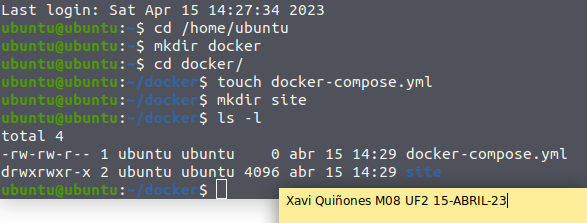

* Paramos Apache2 si lo tenemos instalado en la maquina para evitar conflictos

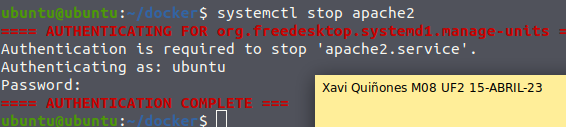

* Configuramos el servicio *web*

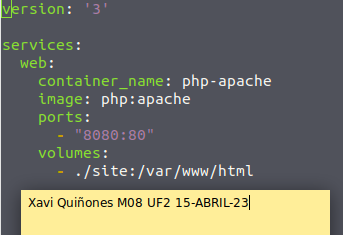

* Nos cambiamos de directorio a _"/site"_ y creamos el archivo index.php que vamos a usar para la prueba

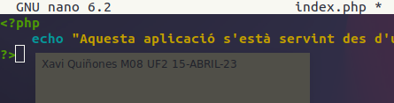

* Lanzamos el docker-compose

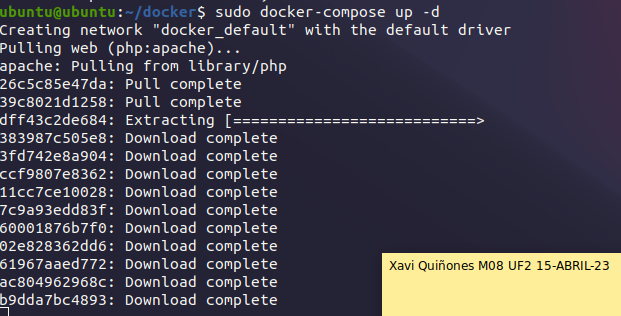

* Probamos desde el navegador

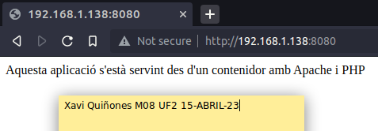

==== Añadir MySQL

[source,yaml]
----
version: '3'

services:
  web:
    container_name: php-apache
    build:
      context: .
      dockerfile: Dockerfile
    ports:
      - "8080:80"
    volumes:
      - ./site:/var/www/html
  db:
    container_name: db
    image: mysql
    restart: always
    environment:
      MYSQL_ROOT_PASSWORD: PASSW_ROOT_MYSQL
      MYSQL_DATABASE: DB_08
      MYSQL_USER: USUARI_MYSQL
      MYSQL_PASSWORD: PASSW_MYSQL
    ports:
      - "3306:3306"
----

* Paramos docker y borramos contenedores *docker-compose down*

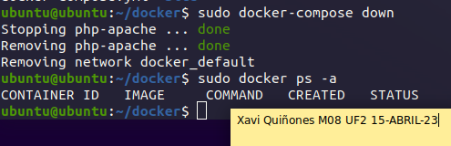

* Creamos el *dockerfile* personalizado con la libreria mysqli

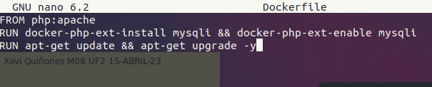

* Editamos el archvo yaml. Añadimos un nuevo servicio, en este caso *db* y lo configuramos con la imagen de apache personalizada

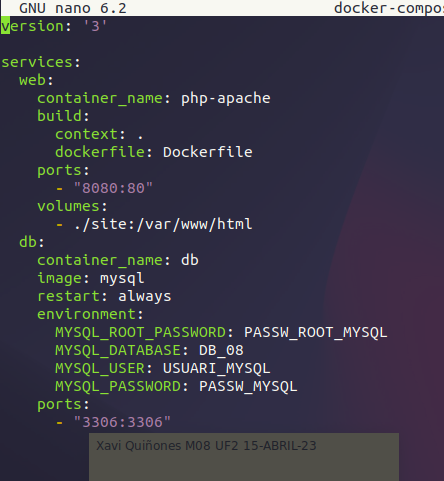

* Modificamos el archivo _index.php_ para probar los nuevos cambios

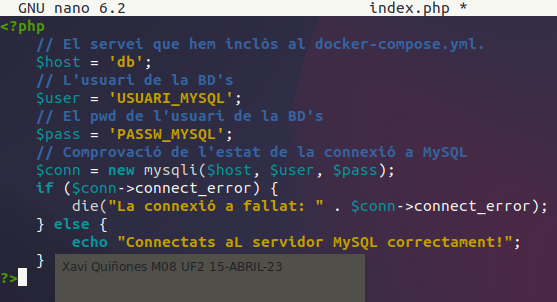

* Ejecutamos de nuevo *docker-compose up -d* y probamos desde el navegador

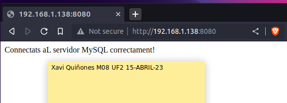

==== Añadir PhpMyAdmin

[source,yaml]
----
version: '3'

services:
  web:
    container_name: php-apache
    build:
      context: .
      dockerfile: Dockerfile
    ports:
      - "8080:80"
    volumes:
      - ./site:/var/www/html
  db:
    container_name: db
    image: mysql
    restart: always
    environment:
      MYSQL_ROOT_PASSWORD: PASSW_ROOT_MYSQL
      MYSQL_DATABASE: DB_M08
      MYSQL_USER: USUARI_MYSQL
      MYSQL_PASSWORD: PASSW_MYSQL
    ports:
      - "3306:3306"
  phpmyadmin:
    container_name: phpmyadmin
    image: phpmyadmin
    ports:
      - "80:80"
    environment:
      PMA_HOST: db
      MYSQL_ROOT_PASSWORD: PASSW_ROOT_MYSQL
    depends_on:
      - db
----

* Paramos y eliminamos

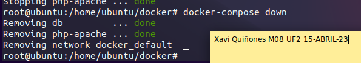

* Editamos el archivo yaml

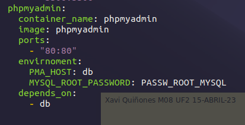

* Ejecutamos de nuevo el docker-compose y entramos desde el navegador por el puerto 80 (asignado a PhpMyAdmin)

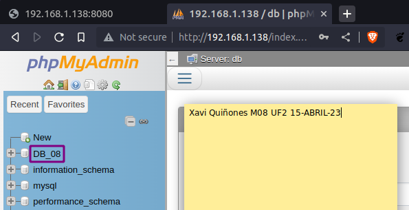

* Ejecutamos las lineas SQL del pdf para crear una tabla 'usuaris' y añadimos algunos registros

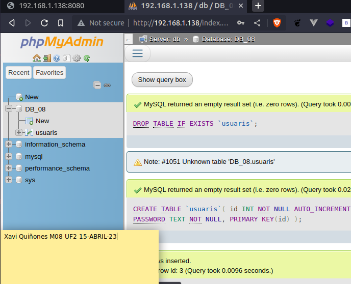

* Editamos index.php para iterar sobre los registros añadidos en la tabla 'usuaris' 

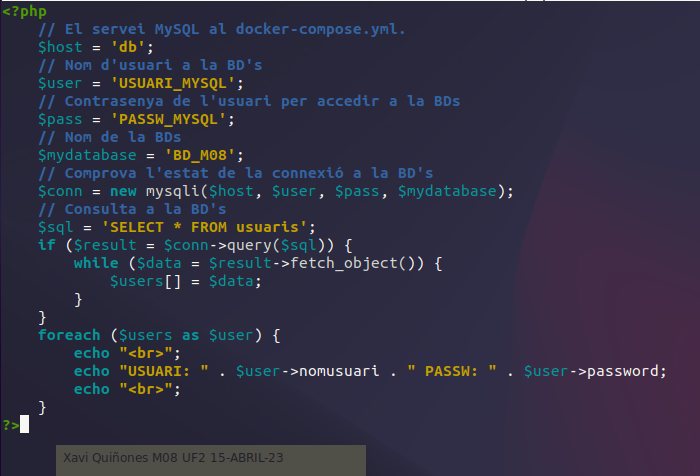

* Comprobamos que funciona

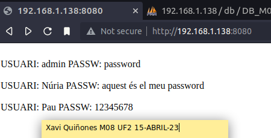

[INFO]
====
He tenido que realizar algun cambio ya que en el _docker-compose.yml_ tenía puesto DB_M08 y en el _index.php_ BD_M08. Es posible que en alguna captura eso esté mal.
====

=== Activitat 2 - Persistencia

* Creamos un volumen para montar "./data" en "/var/lib/mysql", permitiendo persistir la información de la DB MySQL

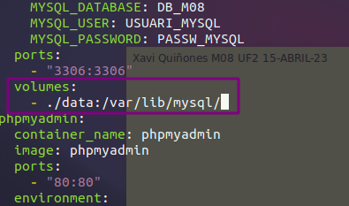