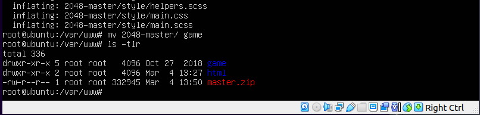
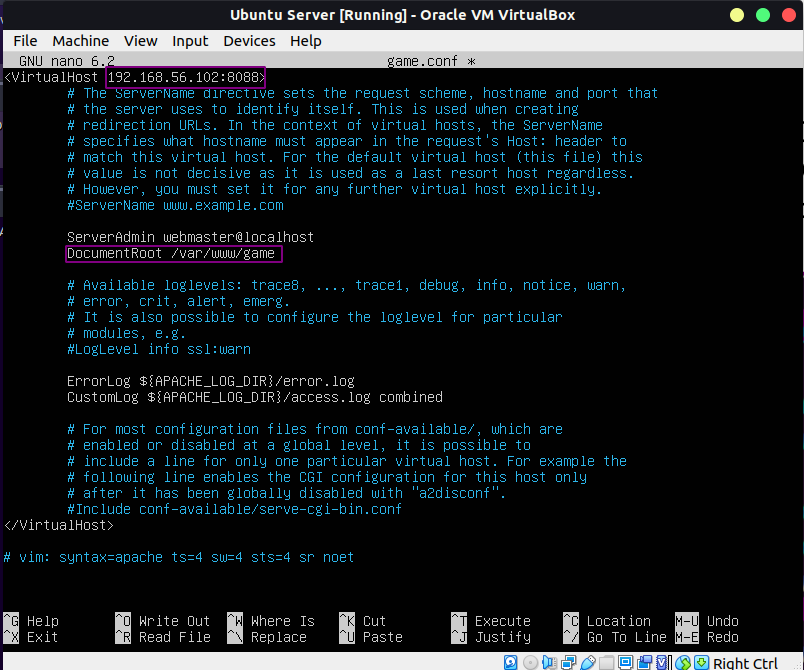
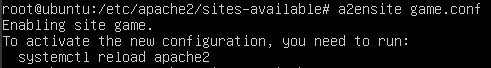
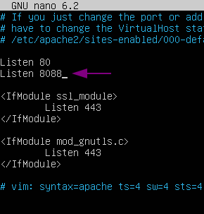
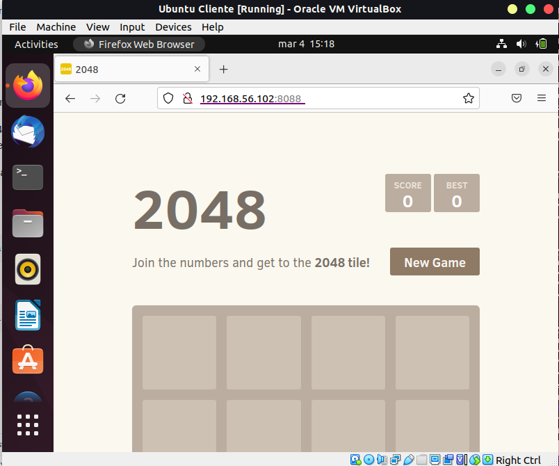
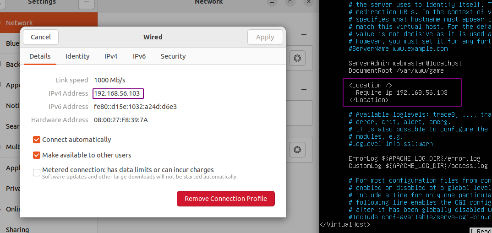
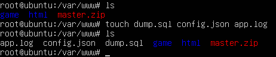
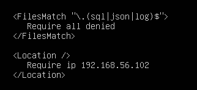
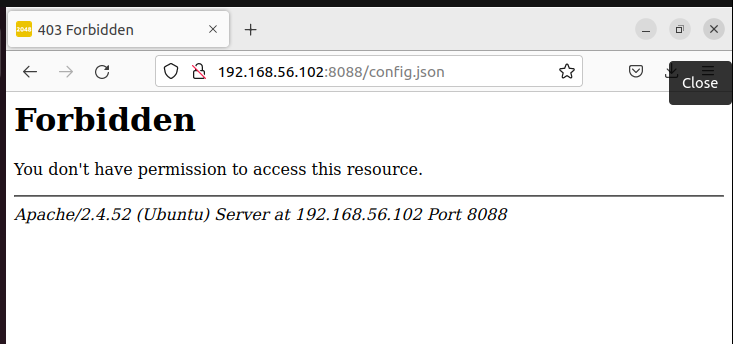

:doctype: book
:figure-caption: IMG
:table-caption: Taula
:example-caption: Ejemplo
:author: Xavi Quiñones
:email: mail@xavi.tech
:revdate: 4 mar 2023
:revnumber: 1.0
:encoding: utf-8
:lang: es
:toc: left
:toclevels: 3
:icons: font

= Apache 2 - Amplicació, per Xavier Quiñones

== Parte 1 

=== Clonar repositorio y crear directorio

- Cambiamos a _root_ con sudo su

- Descargamos el repositorio con wget y descomprimimos el archivo con unzip

- renombramos el directorio _2048-master_ a _game_

=== Crear archivo *.conf

- Nos movemos a _/etc/apache2/sites-available_ con cd

- Creamos una copia de la plantila con cp

- Editamos la plantilla con nano como en la imagen

=== Activar site

- Ejecutamos a2ensite game.conf

=== Configurar puerto en Apache

- Indicamos a Apache que escuche el puerto 8088

- Recargamos apache con systemctl

=== Acceder desde Host Desktop

=== Restringir acceso a una unica IP

- Editamos nuevamente el archivo game.conf que se encuentra en sites-available

- Abrimos con <Location />

- Indicamos IP con *Require ip 192.168.56.102

- Cerramos con </Location>

- Reiniciamos el servicio de nuevo _systemctl restart apache2_

== Parte 2

=== Crear archivos

- Creamos los archivos con touch

.Los he movido luego, me he equivocado de dir

=== Restringir archivos 

- Creamos una etiqueta _FilesMatch_ indicando los formatos de archivo que no queremos exponer, como en la imagen

- Reiniciamos Apache

[NOTE]
====
Se debe tener en cuenta que el orden de las directivas es importante, primero el FilesMatch, luego Location.
====

