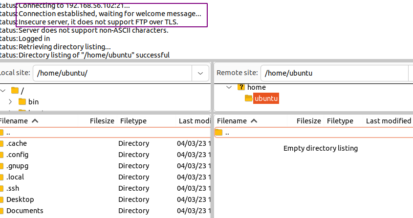
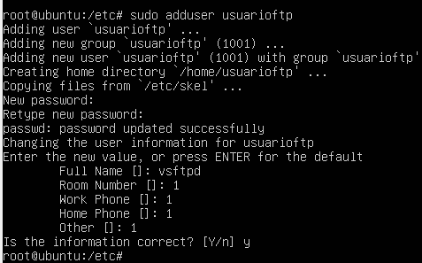

:doctype: book
:figure-caption: IMG
:table-caption: Taula
:example-caption: Ejemplo
:author: Xavi Quiñones
:email: mail@xavi.tech
:revdate: 4 mar 2023
:revnumber: 1.0
:encoding: utf-8
:lang: es
:toc: left
:toclevels: 3
:icons: font

= Práctica VSFTPD

== Instal·la el vsFTPd al servidor Ubuntu Server

[source,bash]
====
sudo apt install vsftpd
====

== Inicia el servei al servidor i comprova el seu estat

=== Inicia el servei
[source,bash]
====
systemctl start vsftpd
====

=== Comprova el seu estat
[source,bash]
====
systemctl status vsftpd
====

== Obre Filezilla i afegeix el servidor per tal de connectar-t'hi. Prova de fer-ho utilitzant només FTP i Requerint TLS

- No he podido hacerlo con TLS. Con conexion insegura si que me ha dejado

== Pots entrar? Pots accedir a tot el sistema d’arxius? Quines accions et permet fer?

Con TLS no he podido conectar. Puedo acceder a el home del usuario y no puedo subir archivos pero si descargar.

== Configura els parametres necessaris a l’arxiu vsftpd.conf per realitzar una connexió TLS que l’usuari pugui baixar i pujar arxius.

=== Creamos un usuario en el sistema

[source,bash]
====
systemctl status usuarioftp
====

=== Instalamos OPENSSL

[source,bash]
====
sudo apt-get install openssl
====

=== Creamos un certificado

- Usamos el programa *openssl* para crear un certificado autofirmado con clave privada RSA de 2048 bits, que dura 9999 días 

[source,bash]
====
sudo openssl req -x509 -nodes -days 9999 -newkey rsa:2048 -keyout /etc/ssl/private/vsftpd.pem -out /etc/ssl/private/vsftpd.pem
sudo chmod 600 /etc/ssl/private/vsftpd.pem
====

- Le damos permisos 600 (solo root puede acceder a el archivo, por motivos de seguridad)

[source,bash]
====
sudo chmod 600 /etc/ssl/private/vsftpd.pem
====

=== Editamos el archivo de configuración (vsftpd.conf)

Cambiamos los siguentes parámetros:

[source]
write_enable=YES
chroot_local_user=YES
allow_writeable_chroot=YES
ssl_enable=YES
rsa_cert_file=/etc/ssl/private/vsftpd.pem
rsa_private_key_file=/etc/ssl/private/vsftpd.pem
ssl_tlsv1=YES

- *write_enable* - Permite escritura

- *chroot_local* - Encierra el usuario en su directorio de inicio (/home/usuario)

- *ssl_enable* - Habilita el uso de SSL

- *rsa_cert_file / rsa_private_key_file* - Espeficidamos ubicación de los certificados

- *ssl_tlsv1* - Habilita el uso de TLS

